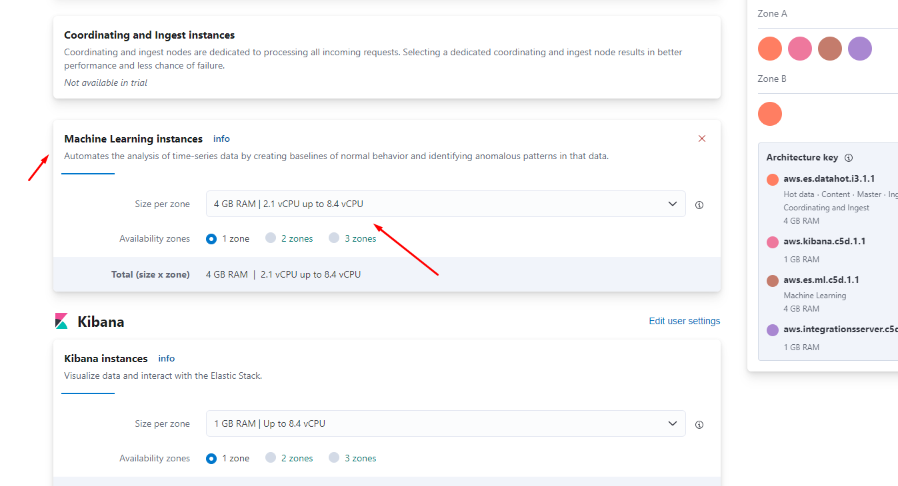
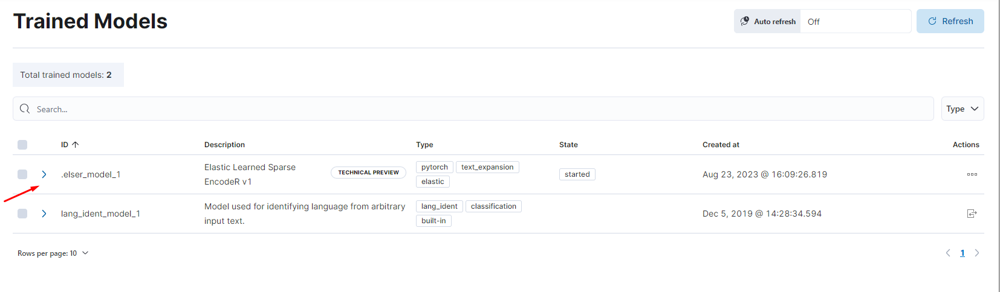
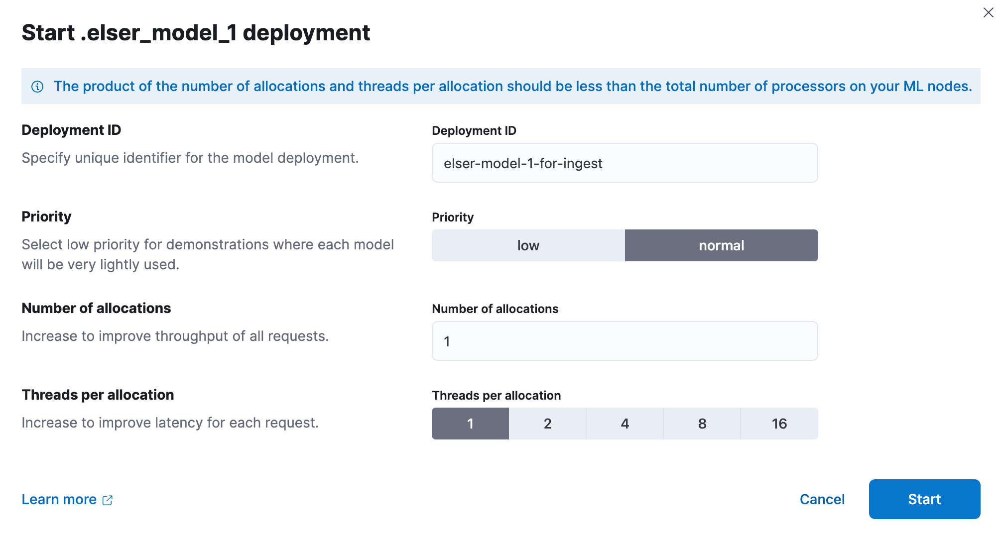
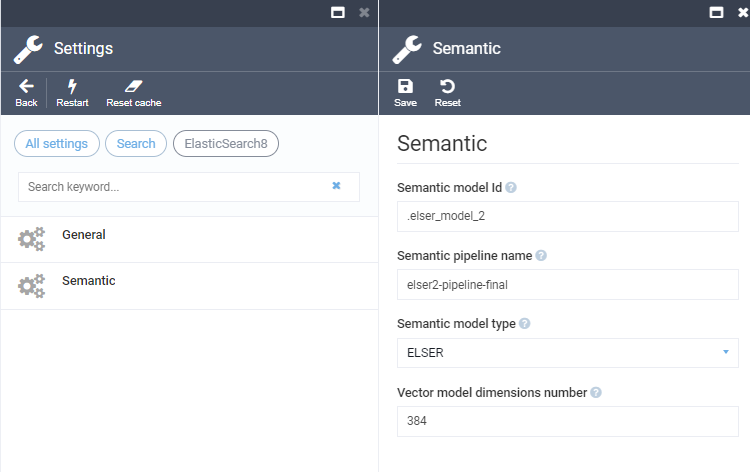
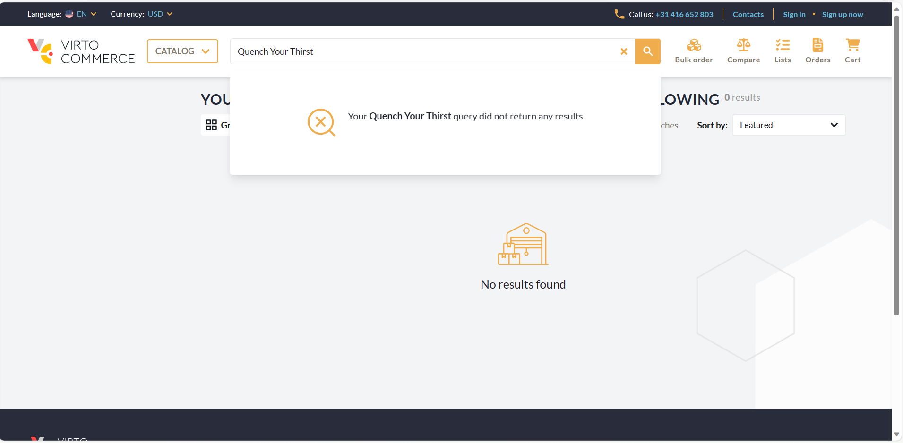
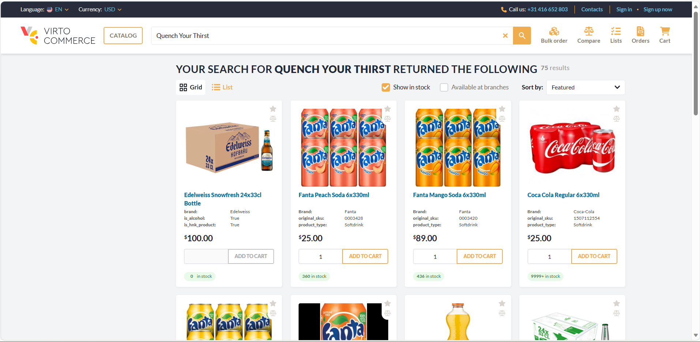

# Virto Commerce Elastic Search 8 Module (Preview)

## Overview

The Virto Commerce Elastic Search module implements the ISearchProvider defined in the VirtoCommerce Search module. It leverages the Elasticsearch engine to store indexed documents.

The module supports the following Elasticsearch deployment options:
* Standalone Elasticsearch 8.x
* Elastic Cloud 8.x

## Features
* New .NET client for Elasticsearch
* Semantic Search (Preview)

## Know Limitations & Issues
* Catalog object serialization via "Store serialized catalog objects in the index" platform settings is not implemented. Document field "__object" will not be indexed.
* BlueGreen indexation is not implemented.
* Partial indexation is not implemented.

## Configuration
The Elastic Search provider can be configured using the following keys:

* **Search.Provider**: Specifies the search provider name, which must be set to "ElasticSearch8".
* **Search.Scope**: Specifies the common name (prefix) for all indexes. Each document type is stored in a separate index, and the full index name is scope-{documenttype}. This allows one search service to serve multiple indexes. (Optional: Default value is "default".)

* **Search.ElasticSearch8.Server**: Specifies the network address and port of the Elasticsearch server.
* **Search.ElasticSearch8.User**: Specifies the username for the Elasticsearch server.
* **Search.ElasticSearch8.Key**: Specifies the password for the Elasticsearch server.
* **Search.ElasticSearch8.CertificateFingerprint**: During development, you can provide the server certificate fingerprint. When present, it is used to validate the certificate sent by the server. The fingerprint is expected to be the hex string representing the SHA256 public key fingerprint. (Optional)


## Samples
Here are some sample configurations for different scenarios:

### Elasticsearch v8.x server
For local v8.x server, use the following configuration:

```json
"Search": {
    "Provider": "ElasticSearch8",
    "Scope": "default",
    "ElasticSearch8": {
        "Server": "https://localhost:9200",
        "User": "elastic",
        "Key": "{PASSWORD}"
    }
}
```

### Elastic Cloud v8.x
For Elastic Cloud v8.x, use the following configuration:

```json
"Search": {
    "Provider": "ElasticSearch8",
    "Scope": "default",
    "ElasticSearch8": {
        "Server": "https://vcdemo.es.eastus2.azure.elastic-cloud.com",
        "User": "elastic",
        "Key": "{SECRET_KEY}"
    }
}
```

## Semantic Search (Preview)

### Overview
Semantic search is a search method that helps you find data based on the intent and contextual meaning of a search query, instead of a match on query terms (lexical search).


Elasticsearch provides semantic search capabilities using natural language processing (NLP) and vector search. Deploying an NLP model to Elasticsearch enables it to extract text embeddings out of text. Embeddings are vectors that provide a numeric representation of a text. Pieces of content with similar meaning have similar representations.


### NLP models
Elasticsearch offers the usage of a wide range of NLP models, including both dense and sparse vector models. Your choice of the language model is critical for implementing semantic search successfully. 

By default, we recommend using ELSER model. Elastic Learned Sparse EncodeR (ELSER) - is an NLP model trained by Elastic that enables you to perform semantic search by using sparse vector representation.  

### Prerequisites

Elastic Cloud 8.9 or higher should be deployed and configured.

### Enable Machine Learning Instances
After creating a Elastic Cloud deployment, you'll need to enable Machine Learning capabilities:

1. Navigate to [deployments page](https://cloud.elastic.co/home)
2. In your deployment list click on Manage 
3. Click Actions - Edit Deployment
4. Find Machine Learning instances and click +Add Capacity: 4 GB RAM, 1 zone
5. Click on Save and wait till configuration apply



### Activate Machine Learning Model
After enabling Machine Learning instances, you'll need to activate Machine Trained model:

1. Navigate to Kibana
2. In your deployment open Analytics - Machine learning - Trained models
3. On .elser_model_2 click Download model. (There are two versions available: one version which runs on any hardware and one version which is `linux-x86_64` optimized. You can see which model is recommended for your cluster's hardware configuration)
4. After the download is finished, start the deployment by clicking the Start deployment button.
5. Provide a deployment ID, select the priority, and set the number of allocations and threads per allocation values.
6. Click Start





### Configure Pipeline Ingester

1. Navigate to Management - Dev Tools
2. Create an ingest pipeline with an inference processor to use ELSER to infer against the data that is being ingested in the pipeline:

```json
PUT _ingest/pipeline/elser-v2-pipeline
{
  "processors": [
    {
      "inference": {
        "model_id": ".elser_model_2",
        "ignore_failure": true,
        "input_output": [ 
          {
            "input_field": "name",
            "output_field": "__ml.tokens"
          }
        ]
      }
    }
  ]
}
```
For the current ELSER v2 model implementation.

### Reindex and Query Data
1. Navigate to Virto Commerce Settings - Search - ElasticSearch8
2. Enable Semantic Search
3. Check that settings are correct. Make sure that semantic model ID, semantic field name and pipeline name are the same as above.
4. Go to Search Index and rebuild them.
5. After the indexation is finished, you can use Semantic Search.



### Enjoy Semantic Search
Examples below demonstrates comparison between classic and semantic search for the same query: "Quench Your Thirst".

#### Classic Search 


#### Semantic Search


## Documentation
* [Search Fundamentals](https://virtocommerce.com/docs/fundamentals/search/)
* [Elastic .NET Client](https://www.elastic.co/guide/en/elasticsearch/client/net-api/master/introduction.html)
* [Semantic Search](https://www.elastic.co/guide/en/elasticsearch/reference/current/semantic-search.html)

## References
* Deployment: https://docs.virtocommerce.org/docs/latest/developer-guide/deploy-module-from-source-code/
* Installation: https://docs.virtocommerce.org/docs/latest/user-guide/modules/
* Home: https://virtocommerce.com
* Community: https://www.virtocommerce.org

## License

Copyright (c) Virto Solutions LTD.  All rights reserved.

Licensed under the Virto Commerce Open Software License (the "License"); you
may not use this file except in compliance with the License. You may
obtain a copy of the License at

http://virtocommerce.com/opensourcelicense

Unless required by applicable law or agreed to in writing, software
distributed under the License is distributed on an "AS IS" BASIS,
WITHOUT WARRANTIES OR CONDITIONS OF ANY KIND, either express or
implied.
