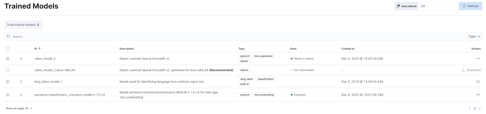

# Virto Commerce Elastic Search 8 Module

The Virto Commerce Elastic Search module implements the ISearchProvider defined in the VirtoCommerce Search module. It leverages the Elasticsearch engine to store indexed documents.

The module supports the following Elasticsearch deployment options:
* Elastic Cloud 8.x
* Standalone Elasticsearch 8.x

## Key features
* Full-text search with new .NET client for Elasticsearch.
* Semantic Search.
* Hybrid Mode Search - combine the best search results from full-text and semantic queries.
* Third-party ML models support.


## Known limitations & issues
* Catalog object serialization via "Store serialized catalog objects in the index" platform settings is not implemented. Document field "__object" will not be indexed.
* Partial indexation is not implemented.

## Configuration
The Elastic Search provider can be configured using the following keys:

* **Search.Provider**: Specifies the search provider name, which must be set to "ElasticSearch8".
* **Search.Scope**: Specifies the common name (prefix) for all indexes. Each document type is stored in a separate index, and the full index name is scope-{documenttype}. This allows one search service to serve multiple indexes. (Optional: Default value is "default".)

* **Search.ElasticSearch8.Server**: Specifies the network address and port of the Elasticsearch server.
* **Search.ElasticSearch8.User**: Specifies the username for the Elasticsearch server.
* **Search.ElasticSearch8.Key**: Specifies the password for the Elasticsearch server.
* **Search.ElasticSearch8.CertificateFingerprint**: During development, you can provide the server certificate fingerprint. When present, it is used to validate the certificate sent by the server. The fingerprint is expected to be the hex string representing the SHA256 public key fingerprint. (Optional)

* **Search.ElasticSearch8.EnableDebugMode**: Turns on settings that aid in debugging so that the original request and response JSON can be inspected. It also always asks the server for the full stack trace on errors. [Read more details here](https://github.com/elastic/elasticsearch-net/blob/main/docs/client-concepts/troubleshooting/debug-mode.asciidoc#L17). (Optional: Default value is false.)


## Samples
Here are some sample configurations for different scenarios:

### Elasticsearch v8.x server
For local v8.x server, use the following configuration:

```json
"Search": {
    "Provider": "ElasticSearch8",
    "Scope": "default",
    "ElasticSearch8": {
        "Server": "https://localhost:9200",
        "User": "elastic",
        "Key": "{PASSWORD}"
    }
}
```

### Elastic Cloud v8.x
For Elastic Cloud v8.x, use the following configuration:

```json
"Search": {
    "Provider": "ElasticSearch8",
    "Scope": "default",
    "ElasticSearch8": {
        "Server": "https://vcdemo.es.eastus2.azure.elastic-cloud.com",
        "User": "elastic",
        "Key": "{SECRET_KEY}"
    }
}
```

## Full-Text Search 
The provider performs full-text keyword searches on a document, optionally with filters and aggregations.

## Semantic Search 

### Overview
Semantic search is a search method that helps you find data based on the intent and contextual meaning of a search query, instead of a match on query terms (lexical search).


Elasticsearch provides semantic search capabilities using natural language processing (NLP) and vector search. Deploying an NLP model to Elasticsearch enables it to extract text embeddings out of text. Embeddings are vectors that provide a numeric representation of a text. Pieces of content with similar meanings have similar representations.


### NLP models
Elasticsearch offers the usage of a wide range of NLP models, including both dense and sparse vector models. Your choice of language model is critical for implementing semantic search successfully. 

By default, we recommend using the ELSER model. Elastic Learned Sparse EncodeR (ELSER) - is an NLP model trained by Elastic that enables you to perform a semantic search by using sparse vector representation.

### Enjoy semantic search
Examples below demonstrate a comparison between classic and semantic search for the same query: "Quench Your Thirst".

#### Classic search 


#### Semantic search


## Semantic search and ELSER model setup

### Prerequisites

Elastic Cloud 8.9 or higher should be deployed and configured.

### Enable machine learning instances
After creating an Elastic Cloud deployment, you'll need to enable Machine Learning capabilities:

1. Navigate to [deployments page](https://cloud.elastic.co/home)
2. In your deployment list click on Manage 
3. Click Actions - Edit Deployment
4. Find Machine Learning instances and click +Add Capacity: 4 GB RAM, 1 zone
5. Click on Save and wait till the configuration apply


### Activate machine learning model
After enabling Machine Learning instances, you'll need to activate Machine Trained model:

1. Navigate to Kibana
2. In your deployment open Analytics - Machine learning - Trained models
3. On .elser_model_2 click Download model. (There are two versions available: one version which runs on any hardware and one version which is `linux-x86_64` optimized. You can see which model is recommended for your cluster's hardware configuration)
4. After the download is finished, start the deployment by clicking the Start Deployment button.
5. Provide a deployment ID, select the priority, and set the number of allocations and threads per allocation values.
6. Click Start




### Configure pipeline ingester
For the ELSER v2 model implementation.

1. Navigate to Management - Dev Tools
2. Create an ingest pipeline with an inference processor to use ELSER to infer against the data that is being ingested in the pipeline:

```json
PUT _ingest/pipeline/elser-v2-pipeline
{
  "processors": [
    {
      "script": {
        "source": "ctx['__content'] = ctx['__content'].join('. ')" // Merge content fields into one
      }
    },
    {
      "inference": {
        "model_id": ".elser_model_2", // TODO: Replace with your model_id
        "ignore_failure": false,
        "input_output": [ 
          {
            "input_field": "__content", // TODO: Replace with your actual field
            "output_field": "__ml.tokens"
          }
        ]
      }
    }
  ]
}
```

If you need to configure different fields for different document types, you can create a pipeline for each index with if condition inside it:

```json
PUT _ingest/pipeline/elser-v2-pipeline
{
  "processors": [
    {
      "script": {
        "source": "ctx['__content'] = ctx['__content'].join('. ')"
      }
    },
    {
      "inference": {
        "if": "ctx._index.contains('default-product')", // TODO: Replace with your actual index name
        "model_id": ".elser_model_2_virtostart",
        "ignore_failure": false,
        "input_output": [ 
          {
            "input_field": "semantic_description", // TODO: Replace with your actual field
            "output_field": "__ml.tokens"
          }
        ]
      }
    },
    {
      "inference": {
        "if": "ctx._index.contains('default-customerorder')", // TODO: Replace with your actual index name
        "model_id": ".elser_model_2_virtostart",
        "ignore_failure": false,
        "input_output": [ 
          {
            "input_field": "__content", // TODO: Replace with your actual field
            "output_field": "__ml.tokens"
          }
        ]
      }
    }
  ]
}
```


### Reindex and Query Data
1. Navigate to Virto Commerce Settings - Search - ElasticSearch8
2. Enable Semantic Search
3. Check that the settings are correct. Make sure that the semantic model ID, semantic field name and pipeline name are the same as above.
4. Go to Search Index and rebuild them.
5. After the indexation is finished, you can use Semantic Search.


## Semantic search and third-party ML model setup

### Select text embedding model

Select a **text embedding model** from the [third-party model reference list](https://www.elastic.co/guide/en/machine-learning/8.12/ml-nlp-model-ref.html).

### Add trained model

1. Install the Eland Python Client. Eland can be installed with [pip](https://pypi.org/project/pip/):
  ```cmd
  pip install eland
  ```

2. Importing your third-party model. Follow the instructions on importing compatible third-party models:
  ```cmd
  eland_import_hub_model --cloud-id <cloud-id> -u <username> -p <password> --hub-model-id <model-id> --task-type text_embedding
  ```

> **Note:** For demo purpose, you can use [sentence-transformers/msmarco-MiniLM-L-12-v3](https://huggingface.co/sentence-transformers/msmarco-MiniLM-L-12-v3) model.

> **Note:** You can find more information in [Import models with Eland](https://www.elastic.co/guide/en/machine-learning/8.12/ml-nlp-import-model.html)

### Deploy trained model

Navigate to the Machine Learning - Model Management - Trained Models section, and click `Start deployment` in the table row containing your new model to deploy and use it.

### Configure pipeline ingester
Create the pipeline similar to the ELSER model (`__ml` property is predefined in Elastic8 Provider now):
  ```
  PUT _ingest/pipeline/my-text-embeddings-pipeline
  {
    "processors": [
      {
        "inference": {
          "model_id": "sentence-transformers__msmarco-minilm-l-12-v3",
          "target_field": "__ml",
          "ignore_failure": true,
          "field_map": {
            "name": "text_field"
          }
        }
      }
    ]
  }
  ```

### Reindex and query data
1. Navigate to Virto Commerce Settings - Search - ElasticSearch8
1. Enable Semantic Search
1. Select Third Party model type in platform settings.
1. Check that the settings are correct. Make sure that the semantic model ID, semantic field name and pipeline name are the same as above.
1. Go to Search Index and rebuild them.
1. After the indexation is finished, you can use Semantic Search.


> **Note:** Depending on the number of dimensions of your model you might need to adjust Semantic Vector Model Dimensions settings.

## How to explain?
The Elastic provides an explain API that computes a score explanation for a query and a specific document. This can give useful feedback on whether a document matches or doesn’t match a specific query.

This provided script serves as a versatile tool for testing and exploring the capabilities of Elasticsearch, specifically tailored for a Virto Commerce Elastic Search 8 release. It combines several features to demonstrate querying and scoring mechanisms.

**Explanation of Query Parameters:**
* "explain" - This parameter instructs Elasticsearch to compute a score explanation for each document, providing insight into how well each document matches the query.
* "track_total_hits - Ensures that the total number of hits for the query is accurately tracked.
* "min_score" - Specifies the minimum score a document must have to be considered a match. Documents with scores below this threshold will not be included in the results.
* "size" - Specifies the number of documents to return in the results.
* "_source" - Specifies the fields to be included in the result set. In this case, the name, code, score, and description of each document.
* "boost": - Applies a boost factor to both the text expansion and multi-match conditions. Boosting allows emphasizing certain conditions over others, influencing the final score.

```json
POST default-product/_search
{
  "explain": true,
  "track_total_hits": true,
  "min_score": 0.2,
  
  "size": 10, 
  "_source": ["name", "code", "_score"], // Replace with your actual fields
  
  "query":{
    "bool": {
      "filter": [ // Replace with your actual filters
        {
          "term": {
            "__outline": "fc596540864a41bf8ab78734ee7353a3/e55de15e-ff39-4b05-bc7e-c57aede725f5"
          }
        }       ], 
        "should": [
          {
            "text_expansion":{
              "__ml.tokens":{
                "model_id": ".elser_model_2_virtostart", // model_id
                "model_text": "Cat",  // Replace with your query
                "boost": 1
              }
            }
          },
          {
            "multi_match": {
              "query": "Cat", // Replace with your query
              "fields": ["__content"],  
              "analyzer": "standard",
              "operator": "and",
              "boost": 1
            }
          }
          ]
    }
  }
}

```

## Optimize performance
The tokens generated by ELSER must be indexed for use in the text_expansion query. However, it is not necessary to retain those terms in the document source.
You can save disk space by using the source exclude mapping to remove the ELSER terms from the document source.

The following links provide more information about source filtering: [Saving disk space by excluding the ELSER tokens from document source](https://www.elastic.co/guide/en/elasticsearch/reference/current/semantic-search-elser.html#optimization)

## Enable debug mode
To facilitate debugging and troubleshooting within the Elasticsearch 8 module for Virto Commerce, you can enable debug mode. This mode configures Elasticsearch to provide detailed request/response logging and enhanced error information.

### Enable debug mode in Elasticsearch options
Set the ElasticSearch8Options::EnableDebugMode property to true in your application configuration.
This will:
1. Disable direct streaming of requests/responses (DisableDirectStreaming()),
1. Allowing raw JSON payloads to be captured. Format JSON output for improved readability (PrettyJson()).
1. Request full error stack traces from the Elasticsearch server on failures.

Example (appsettings.json):

```json
  "ElasticSearch8": {
    "EnableDebugMode": true
  }
```

### Adjust logging levels
Configure the logger for the Elasticsearch provider service to include debug or error details.

Add the following to your logging configuration with either Debug or Error level.

* **Debug** logging provides detailed request/response data, which is useful for troubleshooting but may impact performance. Use sparingly in production environments.
* **Error** logging only captures critical issues and is suitable for general monitoring.

Example (appsettings.Development.json):

```json
{
  "Serilog": {
    "MinimumLevel": {
      "Override": {
          "VirtoCommerce.ElasticSearch8.Data.Services.ElasticSearch8Provider": "Debug"
      }
    },
  }
}
```

Virto Cloud Environment Variable:

```yml
Serilog__MinimumLevel__Override__VirtoCommerce__ElasticSearch8__Data__Services__ElasticSearch8Provider: "Debug"
```

### Warning
Debug mode increases log verbosity and may expose sensitive data. Use it only during development or troubleshooting.

## Documentation

* [Elastic Search 8 module user documentation](https://docs.virtocommerce.org/platform/user-guide/elastic-search-8/overview/)
* [Elastic Search 8 module developer documentation](https://docs.virtocommerce.org/platform/developer-guide/Fundamentals/Indexed-Search/integration/elastic-search-8/)
* [REST API](https://virtostart-demo-admin.govirto.com/docs/index.html?urls.primaryName=VirtoCommerce.ElasticSearch8)
* [Search providers configuration](https://docs.virtocommerce.org/platform/developer-guide/Configuration-Reference/appsettingsjson/#search)
* [View on GitHub](https://github.com/VirtoCommerce/vc-module-elastic-search-8)


## References

* [Deployment](https://docs.virtocommerce.org/platform/developer-guide/Tutorials-and-How-tos/Tutorials/deploy-module-from-source-code/)
* [Installation](https://docs.virtocommerce.org/platform/user-guide/modules-installation/)
* [Home](https://virtocommerce.com)
* [Community](https://www.virtocommerce.org)
* [Download latest release](https://github.com/VirtoCommerce/vc-module-elastic-search-8/releases/latest)

## License

Copyright (c) Virto Solutions LTD.  All rights reserved.

Licensed under the Virto Commerce Open Software License (the "License"); you
may not use this file except in compliance with the License. You may
obtain a copy of the License at

http://virtocommerce.com/opensourcelicense

Unless required by applicable law or agreed to in writing, software
distributed under the License is distributed on an "AS IS" BASIS,
WITHOUT WARRANTIES OR CONDITIONS OF ANY KIND, either express or
implied.
